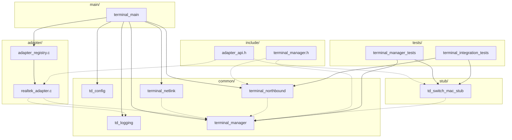
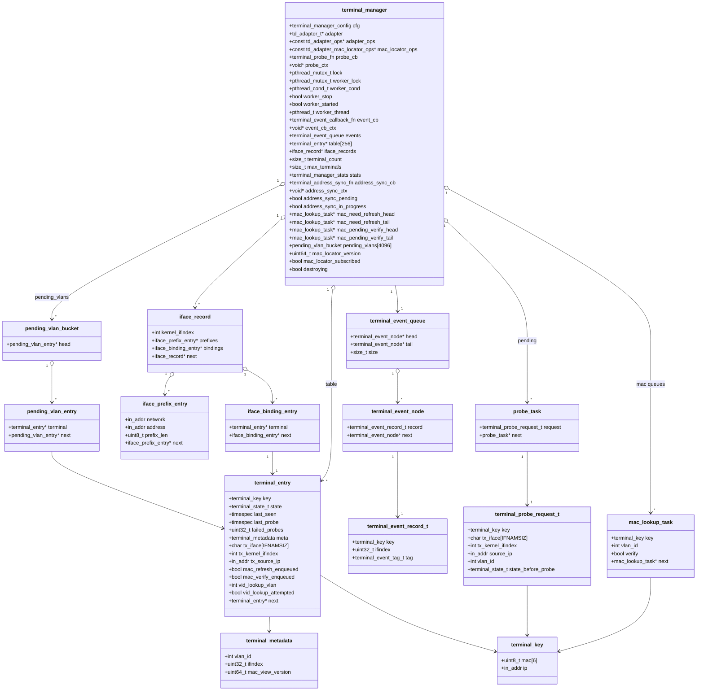
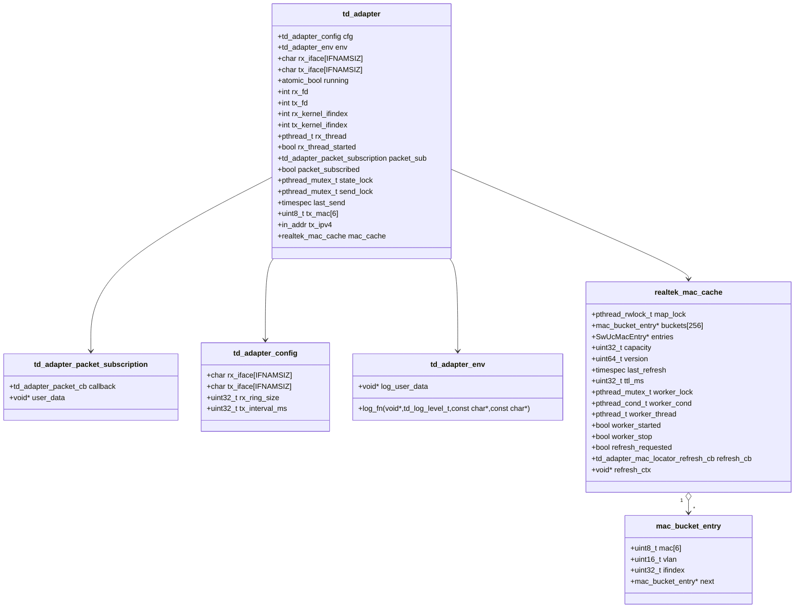
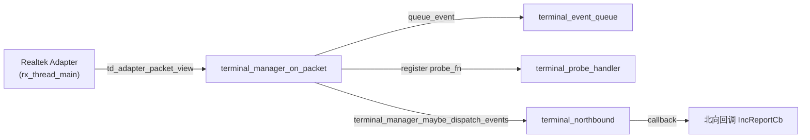
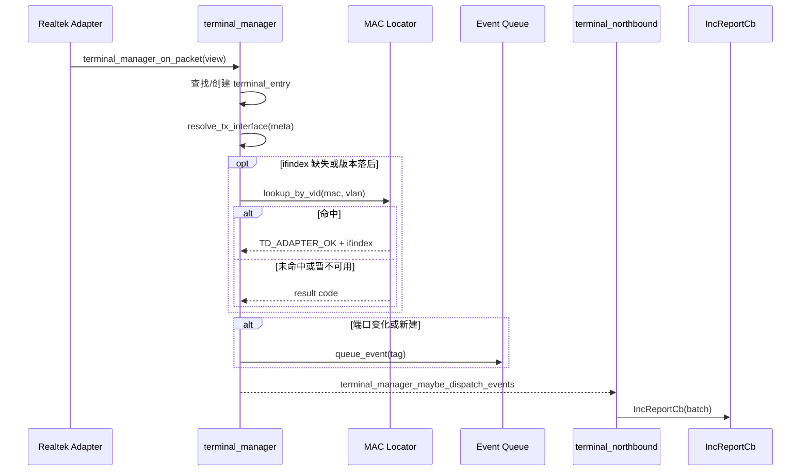
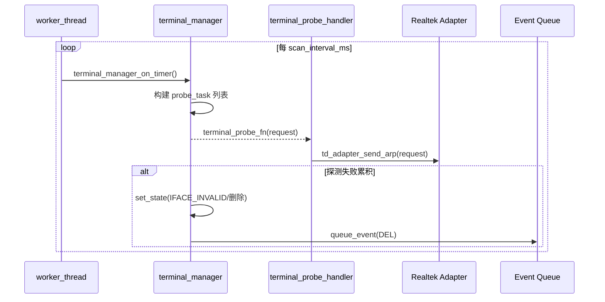
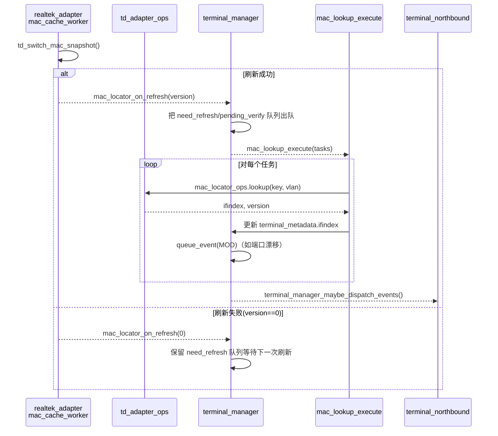
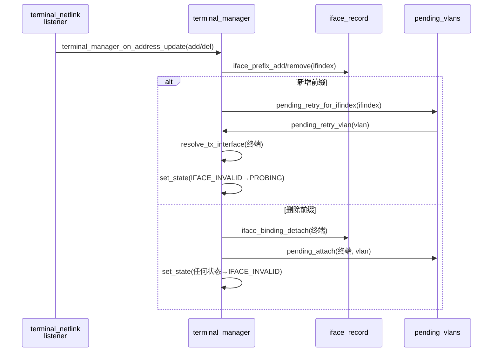
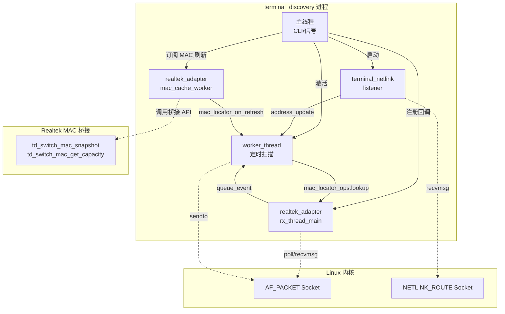

# Terminal Discovery 源码速览

本笔记梳理 `src/` 目录的主要组件、核心数据结构、关键函数和线程模型，便于后续团队成员快速理解与维护终端发现代理。

## 模块分层与构建产物

```
src/
 ├── adapter/
 │   ├── adapter_registry.c/.h
 │   └── realtek_adapter.c/.h
 ├── common/
 │   ├── td_logging.c/.h
 │   ├── td_config.c/.h
 │   ├── terminal_manager.c/.h
 │   ├── terminal_netlink.c/.h
 │   └── terminal_northbound.cpp / terminal_discovery_api.hpp
 ├── include/
 │   ├── adapter_api.h
 │   ├── terminal_manager.h
 │   └── ...（对外暴露的公共头文件）
 ├── main/
 │   └── terminal_main.c
 ├── stub/
 │   └── td_switch_mac_stub.c/.h
 ├── tests/
 │   ├── terminal_manager_tests.c
 │   ├── terminal_integration_tests.cpp
 │   └── ...（单元/集成测试入口）
 ├── demo/
 │   └── ...（示例或验证程序，不参与发布）
 └── ref/
   └── ...（供应商参考实现，仅供查阅）
```

- `adapter/` 集中适配层实现，当前仅有 `realtek_adapter` 提供真实硬件接入能力；适配器代码在本仓默认以对象文件直接与应用/测试链接，不再打包为独立静态库，便于后续平台在各自工程内平移和增量替换。
- `common/` 含业务核心：终端管理器、配置、日志、netlink 与北向桥接实现。
- `include/` 存放跨目录共享的对外头文件，供适配层与测试复用。
- `main/` 目前仅有 `terminal_main.c`，既提供 CLI 启动入口，也导出嵌入式接口 `terminal_discovery_initialize` 及只读 accessor（`terminal_discovery_get_manager` / `terminal_discovery_get_app_context`，声明于 `terminal_discovery_embed.h`）。
- `stub/` 提供 `td_switch_mac_stub` 等模拟组件，主要服务于单元测试与无硬件环境。
- `tests/` 汇总 C/C++ 单元与集成测试入口，新增 `terminal_embedded_init_tests` 覆盖嵌入式初始化回滚与重复注册场景；`make test` 将直接执行此目录下的目标。
- `demo/` 保留实验性/演示用程序，不随正式版本发布。
- `ref/` 仅存放厂商给出的参考代码或头文件，保持只读，用于对照实际实现。

### 构建形式

- 公共跨平台代码（`common/` 目录下的核心 C 文件 + `common/terminal_northbound.cpp` 的北向桥接 + `include/` 下的头文件）产出静态库 `libtd_common.a`，由 `make all`/`make test` 自动生成，也可通过 `make common-lib` 单独构建。
- 平台适配器（当前为 Realtek）以对象文件直接链接：应用与测试目标从 `adapter/*.o`、`stub/*.o` 取用，不再生成适配器静态库，便于后续平台在自有工程内复用或替换。
- 典型命令：
  - `make test`：x86 本地构建并运行所有单元/集成/嵌入初始化测试。
  - `make cross-generic`：使用通用 MIPS 交叉工具链（`mips-linux-gnu-*`）完成编译验证，确保目录拆分与对象直接链接模式在非 x86 环境可行。
  - 交叉编译可通过 `CROSS` 或 `TOOLCHAIN_PREFIX` 注入其他前缀（如 Realtek 生产工具链）。

### 平台适配落地指南

1) 物理分离与编译方式
- 公共跨平台逻辑：仅限 `common/` 与 `include/`（北向桥接具体为 `common/terminal_northbound.cpp` + `include/terminal_discovery_api.hpp`），在宿主或交叉环境先行编译为 `libtd_common.a`，保持与平台无关。不得在此目录引入平台专有头或宏开关。
- 平台相关逻辑：位于 `adapter/`（及可选的 `stub/`），按目标平台在本地工程中直接编译为对象文件并与应用/守护进程链接；不要求生成独立静态库，便于平台侧按需裁剪、替换或增补特定编译选项。
- 引入新平台时，新建 `adapter/<platform>.*`，在各自工程的构建脚本中编译并与 `libtd_common.a` 一起链接；运行期不支持动态选择，构建期必须唯一确定适配器。

2) 链接顺序与裁剪
- 优先链接 `libtd_common.a`，再追加平台适配器对象；如需替换默认 MAC 桥接 stub（`stub/td_switch_mac_stub.o`），在链接命令中将真实 SDK/桥接对象置于 stub 之前或直接移除 stub 对象。
- 嵌入式或最小化场景可剔除 demo/ref 目录，不影响静态库与适配器编译。

3) 工具链与目标
- x86 开发验证：`make test`（默认 GCC/Clang）。
- 通用 MIPS 校验：`make cross-generic`（`mips-linux-gnu-*`）。
- 生产工具链：通过 `CROSS=<prefix>` 或 `TOOLCHAIN_PREFIX=<prefix>` 注入（例如 `mips-rtl83xx-linux-`），保持与现网 Realtek 环境一致。

4) 适配器移植要点
- 保持 `adapter_api.h` 契约不变，新增平台如需扩展字段，应在公共头中向后兼容地声明，并在特定平台对象内部实现。
- 仅适配层可访问平台 SDK/内核特定头文件，公共代码禁止包含平台私有依赖。
- 运行时参数（接口名、发包节流、VLAN 过滤等）只作用于已编译进二进制的适配器，配置文件/CLI 不提供跨平台切换。

5) 新平台接入清单
- 在 `adapter/<platform>.c/.h` 定义 `td_adapter_descriptor`，完整实现 `td_adapter_ops` 的 `init/start/stop/shutdown/register_packet_rx/send_arp`，确保报文订阅与发送路径均可用。
- 若平台支持桥表查询，补齐 `td_adapter_mac_locator_ops`（`lookup`/`subscribe`/`get_version`）；若暂不支持，可先不实现该结构体，必要时仅保留 `stub/td_switch_mac_stub` 作为链接占位。
- RX 路径需将 VLAN、ifindex、源 MAC/IP 封装为 `td_adapter_packet_view` 再调用订阅回调；TX 路径需按照请求中的 VLAN 与回退接口信息填充并发送 ARP。
- 在 `adapter_registry.c` 注册新描述符，并在平台侧构建脚本中将新适配器对象与 `libtd_common.a` 一起链接。

6) 无桥表场景的默认行为
- 若 `td_adapter_mac_locator_ops` 为空，管理器会跳过 MAC 点查与刷新订阅逻辑，保持 `meta.ifindex` 为空，仅依赖报文路径的 VLAN/接口绑定信息驱动状态机；事件仍可由报文触发，但不会产生基于桥表的漂移校验。
- 可选方案：直接不暴露 `mac_locator_ops`，或在内部返回通用错误码以示不支持；此时可保留或替换 `stub/td_switch_mac_stub` 以满足链接。若想用 stub 提供“假桥表”能力，需要在适配层自行封装 `mac_locator_ops` 并转调 stub；否则 stub 仅作为占位，不会被管理器调用。

### 架构视图（模块/组件层）



上述组件关系对应 `terminal_main.c` 的初始化流程：主程序拉起配置与日志组件、从 `adapter_registry` 解析适配器、构造 `terminal_manager` 并串联 netlink 监听与北向回调。`include/` 提供各层共享 API，`stub/` 的 `td_switch_mac_stub` 通过同一接口模拟 MAC 桥接，`tests/` 下的单元/集成测试既验证管理器行为，也验证北向回调与 MAC stub 的协同。

### 1. 日志子系统 `common/td_logging`
- 提供线程安全的日志级别、输出接口（`td_log_writef`）。
- 默认写 `stderr`，并在未注入自定义 sink 时为每条日志添加 `YYYY-MM-DD HH:MM:SS` 的系统时间戳；可通过 `td_log_set_sink` 注入外部回调（适配层使用）。
- `td_log_level_from_string` 支持 CLI 级别解析。

### 2. 运行时配置 `common/td_config`
- `td_config_load_defaults` 输出运行所需的基础参数（适配器名、收发接口、保活周期、容量上限等）。
- `td_config_to_manager_config` 将运行时结构体映射为 `terminal_manager` 的内部配置。
- 默认值与 Stage 4 文档保持一致，可通过 CLI 修改（见 `terminal_main.c`）。

### 3. 平台适配层 `adapter/`
- `adapter_registry` 负责按名称查找适配器（目前仅内置 `realtek`）。
- `realtek_adapter`
  - `td_adapter_ops` 实现：`init/start/stop/register_packet_rx/send_arp/...`
  - **线程模型**：
    - 主线程执行 `init/start` 等生命周期回调。
    - `rx_thread_main` 独立线程轮询 AF_PACKET 套接字，解析 VLAN/ARP，并通过注册的回调上送 `td_adapter_packet_view`。
    - 发送路径在 `send_arp` 内部串行化（互斥锁 + 节流）。
    - `send_lock` 用于保证发送节流 (`last_send`) 与 `sendto` 操作在未来可能的多线程场景下保持串行；当前探测仅来自管理器单线程，即便争用极低，也保留该锁以免后续扩展引入竞态。
  - 默认在物理接口（如 `eth0`）上构造并发送附带 802.1Q 标记的 ARP 帧，封装前先校验 VLAN 是否落在 1–4094 的有效范围，只有在平台拒绝该模式时才回退到绑定 VLAN 虚接口。
  - 所有平台 I/O 均通过原生 Raw Socket 完成，避免依赖平台 SDK。
  - MAC 表定位：
    - `realtek_mac_cache` 维护 `mac_bucket_entry` 哈希桶、`SwUcMacEntry` 缓冲区、缓存 TTL（默认 30s）与单调版本号，初始化时即尝试读取容量并复用同一缓冲区承载 `td_switch_mac_snapshot` 返回的数据。
    - 该结构使用 `map_lock`（读写锁）保护散列表、版本号与快照缓冲区，保证刷新与查询互斥；`worker_lock` + `worker_cond` 驱动后台刷新线程的睡眠/唤醒，`refresh_requested`/`worker_stop` 标记均在此互斥下更新，避免与 `mac_cache_worker_main` 之间的竞态。
    - 注册 `td_adapter_mac_locator_ops`，向上层提供 `lookup/subscribe/get_version`：`subscribe` 拉起后台 `mac_cache_worker_main` 线程并保存回调句柄，`lookup` 在缓存过期时自动触发同步刷新一次，刷新仍失败则返回 `TD_ADAPTER_ERR_NOT_READY` 让终端管理器稍后重试。
    - 刷新线程会在执行 `td_switch_mac_snapshot` 后重建散列表并递增版本；若刷新失败会保留旧数据并记录 WARN，同时通过 `refresh_cb(version=0)` 通知上层，避免终端管理器误判为成功。
    - 订阅回调在每次成功刷新后携带最新版本号，供 `terminal_manager` 的 `mac_locator_on_refresh` 批量补齐 ifindex 并重新验证漂移终端。

### 4. 核心引擎 `common/terminal_manager`
- **主要数据结构**：
  - `terminal_manager`
    - 哈希桶 `table[256]` 存储终端条目。
    - 互斥量 `lock` 保护终端表，`worker_thread` 驱动定期扫描。
    - 事件队列 `terminal_event_queue` 存放北向变更通知。
    - 统计字段 `terminal_manager_stats`（Stage 4 新增）。
    - 地址同步调度：保存注册回调 `address_sync_cb`、上下文 `address_sync_ctx`，并通过 `address_sync_pending`/`address_sync_in_progress` 标记控制执行节奏，确保同一时刻仅有一次同步在运行。
    - MAC 定位上下文：持有适配器提供的 `mac_locator_ops`，维护 `mac_need_refresh_head/tail` 与 `mac_pending_verify_head/tail` 队列、最新的 `mac_locator_version` 以及订阅标志 `mac_locator_subscribed`，用于跟踪桥接刷新状态。
  - `terminal_entry`
    - 记录 MAC/IP、状态机（`terminal_state_t`）、最近报文时间、探测信息和接口元数据。
    - `terminal_metadata.ifindex` 与 `mac_view_version` 存储最近一次 MAC 表查表结果，`mac_refresh_enqueued/mac_verify_enqueued` 标志避免重复排队。
    - 新增 `vid_lookup_vlan/vid_lookup_attempted` 跟踪最近一次 VLAN 点查（`lookup_by_vid`）的上下文：同一 VLAN 内只会在必要时重试，VLAN 发生变化或点查返回 `TD_ADAPTER_ERR_NOT_READY` 时会自动清零，确保新报文或版本刷新可重新触发点查。
  - 缓存最近一次可用的发包上下文：`tx_iface/tx_kernel_ifindex`（仅在需要回退到 VLAN 虚接口时填充）以及 `tx_source_ip`（默认取自可用 VLANIF 的 IPv4，供物理口发包使用）。
  - `terminal_event_record_t`
    - 用于增量事件（`ADD/DEL/MOD`），供北向转换为 `TerminalInfo`。结构包含 `ifindex` 与 `prev_ifindex`，其中 `prev_ifindex` 仅在 `MOD` 事件中携带端口切换前的逻辑索引，其余事件固定为 `0`。
    - 仅当外部注册了事件回调时才会通过 `queue_event` 生成节点；`event_cb == NULL` 时函数直接返回，避免无意义的内存分配，未消费的批次会在统计中累计到 `event_dispatch_failures`。
  - `mac_lookup_task`
    - 封装 MAC 查表请求（终端 key、VLAN、校验标志），由 `mac_need_refresh` 与 `mac_pending_verify` 队列驱动，最终在解锁后批量执行；`verify == true` 表示该任务源自版本刷新后的二次校验，需确认现有 `ifindex` 是否仍与桥表一致，失败时会按照 `mac_lookup_apply_result` 中的逻辑清空旧端口并触发 `MOD` 事件。
  - `pending_vlan_bucket` / `pending_vlan_entry`
    - 以 VLAN ID 为索引的 4096 个桶，挂载仍缺乏有效 `tx_kernel_ifindex` / `tx_source_ip` 的终端；`pending_attach` 会在 `resolve_tx_interface` 失败、地址前缀被删除或绑定被回收时将终端加入桶内，`pending_detach` 则在解析成功后移除。
    - `pending_retry_vlan` 会遍历桶内终端尝试重新绑定，并在成功时将状态改回 `PROBING`；`pending_retry_for_ifindex` 通过 `if_indextoname` 逆解析 VLAN ID，再调用 `pending_retry_vlan`，主要由地址新增事件或初始地址同步成功后触发。
  - `terminal_probe_request_t`
    - `terminal_manager_on_timer` 构造的探测快照，包含终端 key、待使用的 VLAN ID、可选的回退接口和 `source_ip`；`terminal_probe_handler` 依据该结构直接生成以物理口为主、虚接口为备的 ARP 请求。
- **关键函数**：
  - `terminal_manager_create/destroy`：初始化线程、绑定全局单例（`terminal_manager_get_active`）。
  - `terminal_manager_on_packet`：处理适配器上送的 ARP 数据；`apply_packet_binding` 更新 VLAN/ifindex 元数据并调用 `resolve_tx_interface`，在保留 VLAN ID 以支撑物理口发包的同时，获取可选的 VLANIF `kernel_ifindex` 与 `tx_source_ip` 用于构造 ARP；任一环节失败都会清空回退接口绑定并立刻将终端转入 `IFACE_INVALID`。
  - `terminal_manager_on_timer`：由后台线程调用，在进入终端遍历与探测逻辑之前优先调度一次挂起的地址同步回调，然后负责保活探测、过期清理与队列出列；通过回调 `terminal_probe_fn` 执行 ARP 请求。
  - `terminal_manager_on_address_update`：由 netlink 监听器触发的虚接口 IPv4 前缀增删回调，维护可用地址表并触发 `IFACE_INVALID`。
  - `terminal_manager_maybe_dispatch_events`：批量投递事件到北向回调。
  - `terminal_manager_get_stats`：返回当前计数器快照。
  - `terminal_manager_set_address_sync_handler` / `terminal_manager_request_address_sync`：注册平台侧地址同步回调，并在需要时挂起/重试初始 IPv4 地址表抓取。
  - `mac_locator_on_refresh` / `mac_lookup_execute`：订阅适配器 MAC 表刷新回调，基于版本号批量重建 ifindex 视图并在必要时排队 MOD 事件或累计 `event_dispatch_failures`。
- **线程模型**：
  - 后台 `worker_thread` 每 `scan_interval_ms` 唤醒执行 `terminal_manager_on_timer`，在扫描前负责触发一次挂起的地址同步。
  - 适配器 RX 线程在收到报文后调用 `terminal_manager_on_packet`（持 `lock`）。
  - 北向事件分发在脱锁后执行，避免长时间占用互斥量。

#### MAC 表 ifindex 维护

- `terminal_manager_create` 会在检测到适配器实现 `mac_locator_ops` 时初始化缓存版本并注册 `mac_locator_on_refresh`。刷新回调在持锁状态下合并 `mac_need_refresh` 与 `mac_pending_verify` 队列，并遍历全部终端，将 `ifindex` 缺失或版本过期的条目排队查表。
- `terminal_manager_on_packet` 在定位 ifindex 时先尝试调用适配器暴露的 `lookup_by_vid`：当终端在当前 VLAN 上尚未点查或 VLAN 已发生变化时，直接触发点查；命中立即写回 `meta.ifindex` 并将 `vid_lookup_vlan/vid_lookup_attempted` 记录为最新值，未命中也会同步版本号以避免重复排队；若桥接返回 `TD_ADAPTER_ERR_NOT_READY` 或其他异常，则清空点查标记并按原有版本驱动流程进入 `mac_need_refresh`。
- 解锁后由 `mac_lookup_execute` 执行批量查表：
  - 命中时更新 `terminal_metadata.ifindex` 与 `mac_view_version`，若端口发生漂移，会通过事件队列投递 `MOD` 并同步反向索引；
  - `verify` 任务由 `mac_locator_on_refresh` 在检测到 `version` 前进时生成：对于已有 `ifindex` 但 `mac_view_version < version` 的终端，会进入 `mac_pending_verify` 队列，查表失败（返回 `TD_ADAPTER_ERR_NOT_READY`）时立即清零终端的 `ifindex`，保证北向能尽快感知端口失效；
  - SDK 返回暂不可用（`TD_ADAPTER_ERR_NOT_READY`）或桥接失败时会保留队列状态，等待下一轮刷新或定时器重新排队；刷新队列中的非校验任务会复用 `enqueue_need_refresh` 再次尝试。
  - 查表过程中所有事件统计在 `terminal_manager_stats.events_dispatched/event_dispatch_failures` 中体现，缺少回调时清空队列也会自增失败计数。
- `terminal_manager_on_packet` 和 `terminal_manager_on_timer` 均会在检测到版本落后或 `ifindex` 缺失时主动入队查表任务，确保不依赖新的 MAC 刷新信号即可尝试恢复端口信息。
  - 两条路径在解锁后都会调用 `mac_lookup_execute`，该函数顺序执行适配器查表并在完成后触发一次 `terminal_manager_maybe_dispatch_events`，确保查表过程中积累的 `MOD/DEL` 事件能够及时推送。
  - 查表结果只会更新 `terminal_metadata.ifindex/mac_view_version` 以及必要的 `MOD` 事件，整个流程不会直接调用 `set_state`，终端状态仍然由接口可达性和保活逻辑决定。

  #### 终端状态机

  `terminal_manager` 中的 `terminal_entry.state` 由 `set_state` 在多个调用点更新，用于标识终端是否具备发包能力以及是否需要保活。

  **抽象视图**

  抽象视图将状态机压缩为三种语义状态，便于在高层次理解终端的生命周期与集中管理目标。

  ```mermaid
  stateDiagram-v2
    state "已可联通" as LINKED
    state "正在确认" as VERIFYING
    state "无可用接口" as UNBOUND

    [*] --> LINKED
    LINKED --> VERIFYING : 保活周期到
    VERIFYING --> LINKED : 探测成功或新报文
    LINKED --> UNBOUND : 接口/地址不可用
    VERIFYING --> UNBOUND : 探测前发现接口不可用
    UNBOUND --> VERIFYING : 新报文触发重建
    UNBOUND --> [*] : 保留期到期删除
  ```

  其中 `LINKED` 表示终端已经具备可发包接口，`VERIFYING` 表示进入保活确认阶段，`UNBOUND` 表示暂时缺失回程路径；终端在接口异常或保活失败时会离开 `LINKED`，并在收到新报文或探测成功后逐步恢复。

  **实现视图**

  实现视图直接对应 `terminal_state_t` 的 `ACTIVE/PROBING/IFACE_INVALID`，展示具体转移条件与淘汰路径。

  ```mermaid
  stateDiagram-v2
    [*] --> ACTIVE : 首次有效 ARP
    ACTIVE --> PROBING : 保活定时超出 keepalive_interval
    PROBING --> ACTIVE : 收到新报文 / 保活成功
    PROBING --> IFACE_INVALID : 探测前接口不可用
    PROBING --> [*] : failed_probes >= keepalive_miss_threshold
    ACTIVE --> IFACE_INVALID : resolve_tx_interface 失败或地址前缀被移除
    IFACE_INVALID --> PROBING : 新报文触发且接口重新解析成功
    IFACE_INVALID --> [*] : 超过 iface_invalid_holdoff_sec
  ```

  关键判断点对应源码中的：
  - `terminal_manager_on_packet`：刷新 `last_seen`、清零 `failed_probes`，若 `resolve_tx_interface` 失败则立即 `set_state(IFACE_INVALID)`；成功时根据旧状态切回 `ACTIVE` 或 `PROBING`。
  - `terminal_manager_on_timer`：仅当 `is_iface_available` 成立时才进入 `PROBING` 并排队探测；无法发包则保持/转入 `IFACE_INVALID`。连续探测失败满足阈值后删除终端。
  - `terminal_manager_on_address_update`：当接口前缀被删除，调用 `iface_binding_detach` 并 `set_state(IFACE_INVALID)`；新增前缀只更新仍绑定终端的 `tx_source_ip`。
  - `has_expired`：在 `IFACE_INVALID` 持续超过 `iface_invalid_holdoff_sec` 时触发淘汰，保障异常终端不会无限保留。
  - `mac_locator_on_refresh` / `mac_lookup_execute`：仅更新 `terminal_metadata.ifindex` 与事件队列，不会直接驱动 `terminal_entry.state` 变化，状态仍由是否可发包的接口条件决定。

  ##### IFACE_INVALID 恢复细节

  - 任意路径命中 `IFACE_INVALID`（例如 `resolve_tx_interface` 失败、地址事件移除前缀）都会先调用 `iface_binding_detach`，立即从 `iface_records` 的绑定列表中移除终端并清空 `tx_iface/tx_kernel_ifindex/tx_source_ip`。MAC 查表失败仅会把 `meta.ifindex` 清零，状态仍由后续流程依据 `is_iface_available` 判定是否需要进入 `IFACE_INVALID`。
  - 定时器扫描阶段通过 `is_iface_available` 判断是否具备 `tx_kernel_ifindex` 与 `tx_source_ip`；若任一字段缺失则保持 `IFACE_INVALID`，并依赖 `iface_invalid_holdoff_sec` 的到期逻辑进行淘汰，不会发起探测。
  - 只有当新的 ARP 报文到达并让 `resolve_tx_interface` 再次成功（形成新的绑定且写回源 IP）时，状态才会从 `IFACE_INVALID` 切换至 `PROBING`；后续需再次收到报文或探测成功才会恢复到 `ACTIVE`。若报文抵达时仍缺少可用前缀，状态将维持在 `IFACE_INVALID` 直至地址同步完成。
  - 当前实现不会在同一次状态更新中直接从 `IFACE_INVALID` 回到 `ACTIVE`，需严格经历 `IFACE_INVALID` -> `PROBING` -> `ACTIVE` 的顺序。
  - `terminal_manager_on_address_update` 在新增前缀时，仅刷新仍在绑定列表中的终端的 `tx_source_ip`；已被移除绑定的 `IFACE_INVALID` 条目不会即时恢复，需要等待下一次报文或其它触发源重新绑定。
  - 地址删除路径会调用 `monotonic_now` 更新 `last_seen`，使保留期从解绑时刻重新计时，避免因历史时间戳过期而在持锁逻辑之外提前被扫描线程删除。
  - **限制说明**：若终端进入 `IFACE_INVALID` 后迟迟没有新的报文或其它触发源抵达，即便后台地址等外部条件已经恢复可用，也只是刷新元数据而不会触发状态更新；条目会一直停留在 `IFACE_INVALID`，直至 `iface_invalid_holdoff_sec` 到期被淘汰。

#### 调试导出 API

- Stage 7 新增 `td_debug_dump_*` 系列函数，全部受 `terminal_manager.lock` 保护，保证快照过程中的结构一致性；导出逻辑统一使用 `td_debug_writer_t` 抽象写入目的地。
- `td_debug_dump_terminal_table` 遍历 256 个桶并按照可选筛选项（状态、VLAN、ifindex、MAC 前缀、是否展开详细指标等）输出终端列表；采用 `debug_format_wall_clock` 结合单调时钟和壁钟格式化 `last_seen/last_probe`。
- `td_debug_dump_iface_prefix_table` 与 `td_debug_dump_iface_binding_table` 分别导出接口前缀和绑定关系，便于排查 VLAN 虚接口状态、回程 IP 选取及绑定泄漏问题；后者支持 `expand_terminals` 展开终端详情。
- `td_debug_dump_mac_lookup_queue`/`td_debug_dump_mac_locator_state` 提供 MAC 查表队列与桥接刷新版本的统一视图，帮助定位 `mac_locator_ops` 被动刷新与主动查询之间的序列。
- `td_debug_dump_context_t` 与 `td_debug_dump_opts_t` 抽象了导出上下文与过滤条件，`td_debug_context_reset` 允许复用调用方分配的上下文结构；写入回调在设置 `ctx->had_error` 后可让上层停止继续输出。

#### 数据结构关系

以下类图基于 `terminal_manager.c` 中的结构定义，展示核心管理器、事件队列、接口索引与探测任务之间的关系。



事件、接口索引与探测链路均在 `terminal_manager.lock` 保护下维护：
- 地址同步状态（`address_sync_cb/address_sync_ctx/address_sync_pending/address_sync_in_progress`）在持锁环境下登记或复位，实际回调会在解锁后执行；`terminal_manager_on_timer` 在扫描开始前调用内部调度函数触发挂起同步，避免与终端遍历交织。
- 事件队列节点在 `queue_event` 中申请并加入 `terminal_event_queue`，由 `terminal_manager_maybe_dispatch_events` 在脱锁后批量释放。
- `terminal_manager_maybe_dispatch_events` 同时被 `terminal_manager_on_packet`、`terminal_manager_on_timer`、`mac_lookup_execute` 与显式的 `terminal_manager_flush_events` 调用；如果回调缺失或批量分配失败，会在释放节点的同时自增一次 `event_dispatch_failures`。
- `iface_record` 与 `iface_binding_entry` 的增删由 `terminal_manager_on_address_update` 和 `resolve_tx_interface` 驱动，均在持锁状态下保持一致性。
- `probe_task` 链表在 `terminal_manager_on_timer` 内构建（持锁），随后释放锁并逐个执行回调。
- `mac_lookup_task` 队列由 `mac_need_refresh`/`mac_pending_verify` 两条链维护：`terminal_manager_on_packet`、`terminal_manager_on_timer` 与 MAC 刷新回调都会向其中追加任务；真正的桥接查询在解锁后通过 `mac_lookup_execute` 执行，命中后更新 `terminal_metadata.ifindex` 与 `mac_view_version` 并触发必要的 `MOD` 事件。
- Realtek 适配器的 `mac_cache_worker` 线程在刷新 `td_switch_mac_snapshot` 成功后调用订阅回调 `mac_locator_on_refresh(version)`；若失败则上报 `version=0`，管理器会保留待处理任务等待下一轮刷新。
- `pending_vlans` 桶数组在持锁情况下由 `pending_attach/pending_detach` 维护，`pending_retry_vlan` 与 `pending_retry_for_ifindex` 会在重试时遍历桶内链表；成功解析后的终端会在同一锁保护下清除 Pending 记录并复位至可探测状态。

### 5. Netlink 监听器 `common/terminal_netlink`
- `terminal_netlink_start/stop`：管理基于 `NETLINK_ROUTE` 的后台线程，订阅 `RTM_NEWADDR/DELADDR` 并调用 `terminal_manager_on_address_update`。
- 内部线程使用 `poll` 阻塞等待消息，解析 `ifaddrmsg` + `IFA_LOCAL/IFA_ADDRESS` 提取前缀信息，只处理 IPv4 事件。
- 启动阶段会通过 `terminal_manager_set_address_sync_handler` 注册同步回调并立即请求一次地址抓取：优先向内核发起 `RTM_GETADDR` dump，若失败则回退到 `getifaddrs`，并统一记录 WARN 以便部署排查；返回非 0 时管理器会保留挂起标记，由 worker 线程在后续周期自动重试。
- 在 `terminal_main.c` 中随管理器创建启动，销毁流程会优雅退出线程并关闭套接字。

### 6. 北向桥接 `common/terminal_northbound.cpp`
- 向外导出稳定 ABI：`getAllTerminalInfo`、`setIncrementReport`。
- `setIncrementReport`：注册 C++ 回调 `IncReportCb`，内部通过 `terminal_manager_set_event_sink` 绑定事件入口。
- `getAllTerminalInfo`：调用 `terminal_manager_query_all` 生成快照，转换为携带 `ifindex/prev_ifindex` 与 ModifyTag 的 `MAC_IP_INFO`。
- 拥有独立互斥锁 `g_inc_report_mutex` 保证回调注册的线程安全。
- Stage 7 新增 `TerminalDebugSnapshot`（C++ 包装类）与 `TdDebugDumpOptions`（C++ 侧选项结构），通过 `td_debug_dump_*` 接口生成字符串快照；`string_writer_adapter` 充当中转，将 C 回调写入 `std::string` 并在异常/失败时标记 `td_debug_dump_context_t::had_error`。
- **依赖**：使用 `terminal_manager_get_active` 获取全局管理器指针（由 `terminal_manager_create` 绑定）。

### 7. 主程序 `main/terminal_main.c`
- 负责将上述组件组合成终端发现进程：
  1. `td_config_load_defaults` -> 解析 CLI 参数 -> 设置日志级别。
  2. 查找适配器 (`td_adapter_registry_find`)，初始化 `td_adapter_ops`。
  3. 创建 `terminal_manager`，启动 netlink 监听器，并通过 `terminal_northbound_attach_default_sink` 绑定默认日志回调。
  4. 将适配器报文回调绑定至 `terminal_manager_on_packet`。
-  5. 启动适配器并进入主循环（等待信号或 CLI 指令退出）。
-  6. 收到 SIGINT/SIGTERM 或 CLI `exit|quit` 后依次停止适配器、销毁管理器、输出 shutdown 日志。
- 主循环结合 `handle_stats_signal` 与交互式命令行监听处理：接收 `stats`、`dump terminal/prefix/binding/mac queue/mac state`、`show config` 等指令即时输出快照；支持 `set keepalive|miss|holdoff|max|log-level <value>` 动态调整运行参数（内部调用 `terminal_manager_set_*` 与 `td_log_set_level`），并新增 `ignore-vlan add <vid>` / `ignore-vlan remove <vid>` / `ignore-vlan clear` 三条命令用于在线维护收包时的忽略 VLAN 列表；`show config` 现仅调用 `terminal_manager_log_config` 输出 `terminal_config` 组件日志（包含 `ignored_vlans=[...]` 等管理器快照字段）；输入 `exit`/`quit` 可直接请求退出，`help` 可查看命令列表，提示符 `td>` 表示可继续输入。
- `terminal_probe_handler`：实现 `terminal_probe_fn`，按请求中的 VLAN ID 与 `source_ip` 构造物理口 ARP 帧；默认优先走物理接口（例如 `eth0`），仅当 `tx_iface_valid` 标记存在且物理口发送失败时才尝试回退到 VLAN 虚接口。
- 默认日志 sink：由 `terminal_northbound_attach_default_sink` 挂接，输出 `event=<TAG> mac=<MAC> ip=<IP> ifindex=<IDX> prev_ifindex=<PREV>` 格式的 INFO 日志，便于在缺少北向监听器时验证事件流。
- CLI 支持配置适配器名、接口、保活参数、容量阈值、日志级别等，并提供 `exit|quit` 以终止守护进程。
- 通过 `adapter_log_bridge` 将适配器内部日志回落至 `td_logging`。

### 平台适配器核心结构

Realtek 适配器内部状态定义于 `realtek_adapter.c`，关键字段及互斥关系如下：



- `state_lock` 保护订阅回调与 RX 线程状态，避免在运行期重入修改；`packet_subscribed` 标记确保回调只注册一次。
- `send_lock` 与 `last_send` 实现 ARP 发送节流，确保 `realtek_send_arp` 在多次调用时保持顺序与间隔。
- `running` 原子变量用于 `rx_thread_main` 的退出控制，来自 `td_atomic.h` 的轻量封装。
- `mac_cache` 维护桥表快照：`map_lock` 保证哈希桶并发访问，`worker_lock/worker_cond` 控制后台刷新线程，`refresh_cb` 将最新版本号上报给终端管理器。
- `env` 保存可选日志回调及上下文，`adapter_log_bridge` 会通过该指针将适配器内部日志统一导向 `td_logging` 或嵌入式宿主。
- `mac_bucket_entry` 链表为每个 VLAN/MAC 提供 ifindex 缓存，刷新失败时保留旧快照以提高稳定性。

## 通信与顺序

终端发现涉及多线程协同。下列 UML 图根据 `realtek_adapter.c`、`terminal_manager.c` 与 `terminal_main.c` 的实现梳理关键交互。

### 通信图：发现链路



1. Realtek 适配器线程在 `rx_thread_main` 中解析 ARP 与 VLAN，封装为 `td_adapter_packet_view` 并回调管理器。
2. `terminal_manager_on_packet` 更新终端表并按需调用 `queue_event` 将 `ADD/MOD` 事件写入队列。
3. 同一线程在脱锁后调用 `terminal_manager_maybe_dispatch_events`，把批量事件交给注册的北向回调。
4. 主线程在初始化阶段通过 `terminal_probe_handler` 注册探测回调，供 worker 线程生成的探测任务调用。

### 顺序图：终端报文到事件上报



此流程覆盖 `terminal_manager_on_packet` 内部的哈希查找、接口绑定、VLAN 点查与事件入队；当 `lookup_by_vid` 返回 `NOT_READY` 时，终端会在同一轮中被重新排队至 `mac_need_refresh` 等待全量快照。最终 `terminal_manager_maybe_dispatch_events` 会在脱锁后批量上报结果。

### 顺序图：保活探测



探测回调执行于 worker 线程之外，`terminal_probe_handler` 通过适配器的 `send_arp` 与 `send_lock` 节流机制确保与 `realtek_adapter.c` 一致。

### 顺序图：MAC 表刷新与 ifindex 更新



该流程强调 MAC 桥接刷新与终端 ifindex 的解耦：刷新线程永远不持有管理器锁，`mac_lookup_execute` 在无锁上下文顺序查询并在结束后触发一次事件分发，确保 `MOD/DEL` 事件与北向回调保持一致节奏。

### 顺序图：地址事件驱动状态切换与 Pending 重试



该序列展示了地址事件与状态机之间的耦合：当 `terminal_netlink` 报告 `RTM_NEWADDR` 时，管理器会刷新 `iface_record` 并调用 `pending_retry_for_ifindex`，按 VLAN 将挂起终端逐一重试；一旦 `resolve_tx_interface` 再次成功会清理 Pending 链表并把状态推进到 `PROBING`。而 `RTM_DELADDR` 会拆除绑定、将终端收入 Pending 桶并即时切换到 `IFACE_INVALID`，同时更新时间戳以便后续淘汰逻辑准确生效。

## 分配视图（线程与资源）



该视图展示了进程内线程如何占用内核资源：
- Realtek 适配器 RX 线程轮询 `AF_PACKET`，与 worker 线程共享 `td_adapter_send_arp` 输出路径。
- Netlink 线程通过 `NETLINK_ROUTE` 套接字监听 `RTM_NEWADDR/DELADDR`。
- 主线程负责初始化、信号处理和优雅退出，保持与 `terminal_main.c` 的源码一致。

## 多线程与同步

| 线程 | 来源 | 主要职责 | 同步方式 |
| ---- | ---- | -------- | -------- |
| 主线程 | `main()` | CLI 解析、初始化、信号监听、最终清理 | 使用信号处理器设置 `g_should_stop` 原子变量 |
| 适配器 RX 线程 | `realtek_adapter` | `poll` + `recvmsg` 收取 ARP，并调用 `terminal_manager_on_packet` | 访问终端表时依赖 `terminal_manager` 的 `lock` |
| 终端管理器 Worker | `terminal_manager_worker` | 定期扫描终端表、安排探测、淘汰终端，并在扫描前触发挂起的地址同步回调 | `worker_lock` 控制线程休眠，核心操作持 `lock` |
| Netlink 监听线程 | `terminal_netlink` | 订阅 `RTM_NEWADDR/DELADDR` 并更新地址表，启动时先尝试抓取现有 IPv4 前缀 | `terminal_netlink_listener.running` 原子标记线程退出；调用 `terminal_manager_on_address_update` 时获取管理器互斥锁 |
| 北向回调上下文（非独立线程） | `terminal_manager_maybe_dispatch_events` | 由触发事件的线程在脱锁后同步调用外部回调 | 事件队列在 `lock` 下构建；回调执行期间不持锁 |
| MAC 缓存线程 | `realtek_adapter` | 周期性刷新 `td_switch_mac_snapshot` 并触发 `mac_locator_on_refresh` | 刷新后回调在持锁状态下合并 `mac_lookup_task`，真正查表在脱锁环境执行 |

互斥和条件变量主要来源：
- `terminal_manager.lock`：保护终端哈希表、事件队列、统计数据以及 `iface_address_table` / `iface_binding_index`。
- `terminal_manager.worker_lock/cond`：唤醒/停止后台线程。
- `realtek_adapter.state_lock`：保护数据流回调注册。
- `realtek_adapter.send_lock`：串行化 ARP 发送、实现节流。
- `g_inc_report_mutex`：控制北向回调注册。
- `g_active_manager_mutex`：保护全局单例指针 `g_active_manager`，防止多线程并行创建/销毁管理器。

### 资源保护映射

| 锁 / 原子变量 | 保护的资源或不变式 | 主要持有位置 |
| ------------- | ------------------ | ------------ |
| `terminal_manager.lock` | 终端哈希表、事件队列、统计字段、接口前缀表、绑定索引、`probe_task` 与 `mac_lookup_task` 队列创建，以及 `mac_locator_version` | `terminal_manager_on_packet`、`terminal_manager_on_timer`、`terminal_manager_on_address_update`、`mac_locator_on_refresh`、`terminal_manager_get_stats` |
| `terminal_manager.worker_lock` + `worker_cond` | worker 线程睡眠/唤醒与停止标记 | `terminal_manager_start_worker_locked`、`terminal_manager_stop_worker_locked`、`terminal_manager_worker` |
| `g_active_manager_mutex` | 全局活动管理器指针唯一性 | `bind_active_manager`、`unbind_active_manager`、`terminal_manager_get_active` |
| `realtek_adapter.state_lock` | 订阅回调 (`packet_sub`)、RX 线程启动标志 | `realtek_register_packet_rx`、`realtek_start`、`realtek_stop` |
| `realtek_adapter.send_lock` | `last_send` 节流时间戳、`sendto` 调用序列 | `realtek_send_arp` |
| `realtek_adapter.running` (atomic) | 控制 RX 线程循环退出 | `realtek_start`、`realtek_stop`、`rx_thread_main` |
| `g_inc_report_mutex` | 北向增量回调全局句柄 | `setIncrementReport` |
| `realtek_mac_cache.map_lock` (rwlock) | MAC 缓存哈希桶、`entries` 缓冲区、`version` 与刷新时间戳 | `mac_cache_refresh`、`realtek_mac_locator_lookup`、`realtek_mac_locator_get_version` |
| `realtek_mac_cache.worker_lock` + `worker_cond` | 后台刷新线程启动/停止、`refresh_requested` 标记、回调上下文 | `mac_cache_start_worker`、`mac_cache_stop_worker`、`mac_cache_worker_main` |
| `terminal_netlink_listener.running` (atomic) | 控制 Netlink 监听线程循环退出 | `terminal_netlink_start`、`terminal_netlink_stop` |

`mac_lookup_execute` 在脱锁上下文运行：无论任务由 `worker_thread` 还是 MAC 刷新回调触发，都会在释放 `terminal_manager.lock` 后顺序调用适配器的 `mac_locator_ops.lookup`，再重新持锁写回 `ifindex` 与事件结果，避免刷新线程长时间阻塞其他表操作。

## 关键数据流

1. **发现链路**：
  - Realtek 适配器 (`rx_thread_main`) -> `terminal_manager_on_packet`；若终端缺少 ifindex，则优先调用 `mac_locator_ops.lookup_by_vid` 进行 VLAN 点查 -> 更新终端状态/版本 -> 入队事件 -> `terminal_manager_maybe_dispatch_events` -> 北向回调/日志。
2. **保活链路**：
  - Worker 线程 (`terminal_manager_on_timer`) -> 决定是否探测 -> `terminal_probe_handler` -> `realtek_adapter.send_arp` -> 网络。
3. **地址事件链路**：
  - Netlink 监听线程 (`terminal_netlink`) -> 启动时先通过地址同步回调抓取当前 IPv4 前缀（`RTM_GETADDR` -> `getifaddrs` 回退） -> 解析实时 `RTM_NEWADDR/DELADDR` -> `terminal_manager_on_address_update` -> 更新地址表与反向索引；若初始抓取失败，后台 worker 会按照挂起标记持续触发重试直至成功。
  - `RTM_DELADDR` 会触发 `iface_binding_detach`，清理绑定表并调用 `pending_attach` 将终端标记为等待重绑，同时把状态切换为 `IFACE_INVALID` 并重新记录 `last_seen`，以保证淘汰计时基于解绑时刻。
  - `RTM_NEWADDR` 或同步抓取成功后会设置 `retry_pending`，由 `pending_retry_for_ifindex` 定位 VLAN 并调用 `pending_retry_vlan`；凡是可以重新解析的终端会清空 Pending 状态、恢复绑定并推进状态机到 `PROBING`，否则继续保留在 Pending 桶等待下一次机会。
4. **查询接口**：
  - 北向 `getAllTerminalInfo` -> `terminal_manager_query_all` -> C++ 向量结果。
5. **配置入口**：
  - CLI -> `td_runtime_config` -> `td_config_to_manager_config` -> `terminal_manager_create`。
6. **MAC 桥接刷新链路**：
  - Realtek `mac_cache_worker` -> `mac_locator_on_refresh` 合并 `mac_need_refresh`/`mac_pending_verify` -> 脱锁后 `mac_lookup_execute` 调用 `mac_locator_ops.lookup`；报文路径若已通过 `lookup_by_vid` 得到确切结论，会携带最新 `mac_view_version` 直接略过本轮查询 -> 写回 `terminal_metadata.ifindex` 与事件队列 -> `terminal_manager_maybe_dispatch_events`。

7. **Pending 重试链路**：
  - `resolve_tx_interface` 失败、地址删除或绑定被回收时调用 `pending_attach`，终端被存入以 VLAN ID 为索引的桶中并立即进入 `IFACE_INVALID`；随后 `terminal_manager_on_packet`、`pending_retry_for_ifindex` 或 CLI 触发的地址同步成功时，会通过 `pending_retry_vlan` 尝试逐条重绑，成功后由 `pending_detach` 清理桶并重新点亮状态机。

上述 7 条数据流可以结合前述顺序图和分配视图理解跨线程的执行路径，特别是探测调度、MAC ifindex 更新与事件队列在 `terminal_manager.c` 中的互斥保护与脱锁分发逻辑。

## 维护建议
- 修改 `terminal_manager` 状态机或事件逻辑时，同时更新 `doc/design/stage3_event_pipeline.md` 与相关测试计划。
- 引入新平台适配器需要补充 `adapter_registry` 并实现 `td_adapter_ops` 契约。
- 若扩展 CLI 参数，可在 `terminal_main.c` 增加 `getopt_long` 分支，并同步 Stage 4/overview 文档。
- 修改统计字段时，务必保证在持 `lock` 状态下更新/读取以保持线程安全。

## 参考文档
- `doc/design/stage2_terminal_manager.md`: 终端管理器状态机与调度细节。
- `doc/design/stage3_event_pipeline.md`: 事件队列与北向接口设计。
- `doc/design/stage4_observability.md`: 指标、日志与配置增强说明。

本文档可与上述阶段性设计稿配合使用，帮助新成员快速定位代码入口与线程交互方式。
